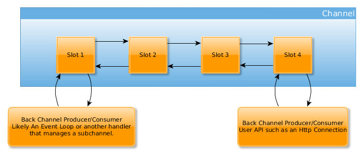
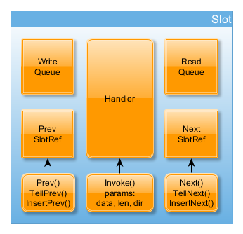
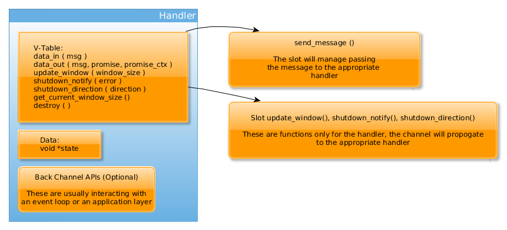
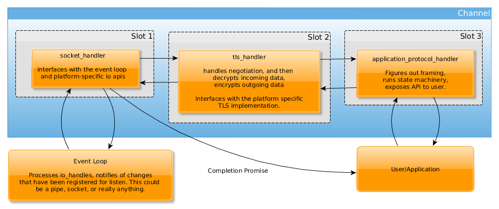
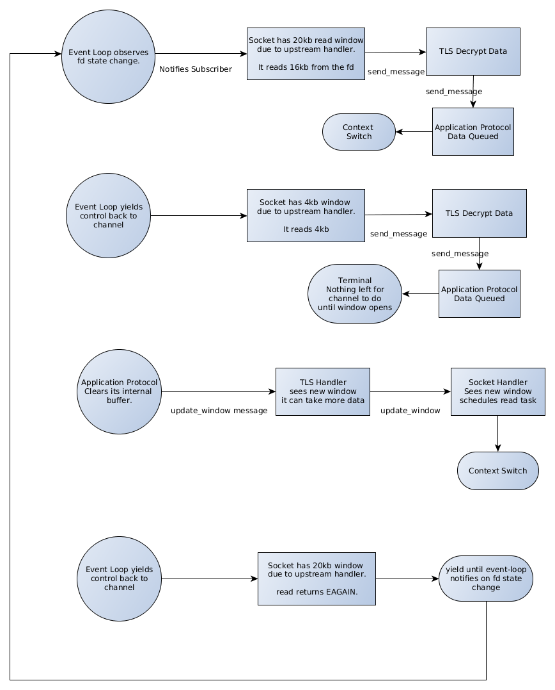

## AWS-C-IO

This is a module for the AWS SDK for C. It handles all IO and TLS work for application protocols. 

aws-c-io is an event driven framework for implementing application protocols. It is built on top of
cross-platform abstractions that allow you as a developer to think only about the state machine and API
for your protocols. A typical use-case would be to write something like Http on top of asynchronous-io
with TLS already baked in. All of the platform and security concerns are already handled for you.

It is designed to be light-weight, fast, portable, and flexible for multiple domain use-cases such as:
embedded, server, client, and mobile.

## License

This library is licensed under the Apache 2.0 License. 

## Concepts

### Event Loop
Core to Async-IO is the event loop. We provide an implementation for most platforms out of the box:

Platform | Implementation
--- | ---
Linux | Edge-Triggered Epoll
BSD Variants and Apple Devices | KQueue
Windows | IOCP (IO Completion Ports)
Default Fallback | Select

Also, you can always implement your own as well.

An Event Loop has a few jobs.

1. Notify subscribers of IO Events
2. Execute and maintain a task scheduler
3. Maintain an opaque data store for consumers

The threading model for a channel (see below) is pinned to the thread of the event loop. Each event-loop implementation
provides a API to move a cross-thread call into the event-loop thread if necessary.

### Channels and Slots
A channel is simply a container that drives the slots. It is responsible for providing an interface
between slots and the underlying event-loop as well as invoking the slots to pass messages. As a channel 
runs, it makes sure that all messages queues are empty before returning control to the caller. It also provides
utilities for making sure slots and their handlers run in the correct thread and moving execution to that thread
if necessary.

In this diagram, a channel is a collection of slots, and it knows how to make them communicate. It also controls the 
lifetime of slots.

When a channel is being shutdown, it will issue shutdown_direction messages in the appropriate direction. If it is in the read
direction, it will call shutdown_direction on the first slot. Conversely, in the write direction, it will call shutdown_direction
on the last slot in the channel. When all slots have successfully shutdown, the channel can be safely cleaned up and de-allocated.

### Slots

Slots contain 2 queues, one for the write (to the io) direction, and one for the read (from the io) direction. Each slot
owns the lifetime of its queues. In addition, they maintain their links to adjacent slots in the channel. So as the channel
is processed, each slot will read from its left-adjacent slot's read queue, send those messages to the handler, and queue
messages to the read queue for that slot. Conversely, each slot will read from its right-adjacent slot's write queue,
send those messages to the handler, and send messages to the write queue for that slot. Most importantly, slots contain a 
reference to a handler. Handlers are responsible for doing most of the work (see below). Finally, slots have an 
API that manages invoking the handler, from the channel's perspective, as well as utilities for manipulating the connections 
of the slots themselves.

Slots can also be added and removed dynamically from a channel. When a slot is removed it will make sure its queues are drained
and its messages moved to the appropriate new siblings. 

### Channel Handlers
The channel handler is the fundamental unit that protocol developers will implement. It contains all of your
state machinery, framing, and optionally end-user APIs.

#### Special, pre-defined handlers
Out of the box you get a few handlers pre-implemented.
1. Sockets. We've done the heavy lifting of implementing a consistent sockets interface for each platform.
Sockets interact directly with the underlying io and are invoked directly by the event loop for io events.
2. Pipes (or something like them depending on platform), these are particularly useful for testing.
3. TLS. We provide TLS implementations for most platforms.

Platform | Implementation
--- | ---
Linux | Signal-to-noise (s2n) see github.com/awslabs/s2n
BSD Variants | s2n
Apple Devices | Security Framework/ Secure Transport. See https://developer.apple.com/documentation/security/secure_transport
Windows | Secure Channel. See https://msdn.microsoft.com/en-us/library/windows/desktop/aa380123(v=vs.85).aspx

In addition, you can always write your own handler around your favorite implementation and use that.

### Typical Channel

A typical channel will contain a socket handler, which receives io events from the event loop.
It will read up to 16 kb and pass the data to the next handler. The next handler is typically 
feeding a TLS implementation (see the above section on pre-defined handlers). The TLS handler
will then pass the data to an application protocol. The application protocol could then expose an
API to an application. When the application wants to send data, the whole process runs in reverse.

Channels can be much more complex though. For example, there could be nested channels for multiplexing/de-multiplexing,
or there could be more handlers to cut down on handler complexity.

Note however, that a channel is always pinned to a single thread. It provides utilities for applications and
handlers to move a task into that thread, but it is very important that handlers and application users
of your handlers never block.

### Channel IO Operation Fairness

Since multiple channels run in the same event loop, we need to make sure channels are not starved by other active channels.
To address this, the handlers consuming IO events from the event loop should determine the appropriate max read and write
and context switch before continuing. A context switch is performed, simply by scheduling a task to run at the current timestamp,
to continue the IO operation.

A reasonable default is 16kb, but a savy implementation may want to upgrade a few connections to 256kb if they notice a particularly
fast connection (e.g. you notice EAGAIN or EWOULDBLOCK is never returned from write() calls).

### Read Back Pressure

One of the most challenging aspects of asynchronous io programming, is managing when back-pressure should be applied to
the underlying io layer. In the read direction, this is managed via update_window messages. Let's look at the below diagram
for an example of how this works.

In this example, we have a channel setup with an event loop which manages io event notifications. The first slot contains a socket handler.
The socket handler will read directly from the socket. The second slot has a TLS handler. 
Its only job is to encrypt/decrypt the data passed to it and pass it back to the channel.
The third and final slot contains the actual application protocol handler (could be Http, SIP, RTP it doesn't really matter).

The application protocol exposes an API to the application. As data is processed, we don't want to endlessly read, allocate,
and process data faster than the application can use it. As a result, it has a 20kb window.

1. The event loop notifies the socket handler that it has data available to read. The handler knows it can read up to 20kb
so it reads a full 16kb from the socket and passes it to the next slot. Since the socket sees that there is still an open window,
it, schedules a task to read again after the other channels have had a chance to process their pending reads. 

    Likewise, the TLS handler decrypts the data and passes
it to the slot containing the application protocol. 

    The application protocol processes the 16 kb and hands it off to the application.
At this point, the application hasn't notified the channel it is finished with the data (suppose application queues it), so the
new window for the slot is 4 kb.

2. The event loop runs the scheduled read task from (1) after processing the other channels. The socket handler sees it
can read 4kb more of data. Even though it can read 16kb at a time, to honor the window, it reads 4kb and passes it on. This
time however, the window is 0, so the socket does not schedule another read task.

    The TLS handler decrypts the data and passes it on

    The application protocol reads 4kb, passes it to the application and its window is 0kb. 

    The channel now goes idle waiting on the application to finish processing its data.

3. The application notifies the channel (via the API on the application protocol handler) it has processed 20kb
of data. This causes the protocol handler to issue an update_window message with an update of 20kb.

    Slot 2 passes the message on to the TLS handler. It evaluates the message and simply, sends a 20kb window update message
    to its slot.

    The socket handler receives the update_window message and schedules a new read task.

4. The event-loop runs the scheduled read task from (3). The socket reads on the io-handle, but it returns EAGAIN or
EWOULD_BLOCK. The channel now goes back to an idle state waiting on the event-loop to notify it that the socket is readable.

### Write Back Pressure

Write back pressure comes into play when the application can produce data more quickly than it can be sent to the 
underlying io. To manage this, messages have members to attach a promise fn and context data to. When a handler exposes
and API, it has the responsibility to take a fn and data from the user if over write is a possibility. The io-handler will
invoke the promise after it has successfully written the last byte to the underlying io.

### Thread Safety

In general, the plan for addressing thread-safety is to not share memory across threads. This library is designed around 
single threaded event loops which process one or more channels. Anywhere a handler or channel exposes a back-channel API,
it is responsible for checking which thread it was invoked from. If it is invoked from the event loop's thread, then it may
proceed as planned. If it is not, it is required to queue a task to do the work. When the task is executed, it will be executed
in the correct thread.

## Terminology
We use a few terms in the following sections that are not necessarily "C concepts". We assume you know C, but here's some
definitions that may be helpful.

### Run-time Polymorphic
This means that the API is driven by a virtual-table. This is simply a struct of function pointers. They are invoked via
a c extern style API, but ultimately those public functions simply invoke the cooresponding function in the v-table.

These are reserved for types that: 
a.) Need to be configurable, changable at runtime
b.) Do not have immediate performance concerns caused by an indirect function call.

### Compile-time Polymorphic
This means that the API is not necessarily driven by a virtual-table. It is exposed as a c extern style API, but the 
build system makes a decision about which symbols to compile based on factors such as platform and compile-time flags.

These are reserved for types that:
a.) Need to be configurable at compile-time based on platform or compile-time options.
b.) Have performance concerns caused by an indirect function call.

Note: that runtime configurability may still be something we need to expose here. In that case, a compiler flag
will be used to denote that we are using a custom implementation for x feature. Then we will expose an implementation
that indirectly invokes from a v-table and provides hooks for the application to plug into at runtime.

### Promise, Promise Context
There are many phrases for this, callback, baton, event-handler etc... The key idea is that APIs that need to notify a 
caller when an asynchronous action is completed, should take a callback function and a pointer to an opaque object
and invoke it upon completion. This term doesn't refer to the layout of the data. A promise in some instances may be a 
collection of functions in a structure. It's simply the language we use for the concept.
 
## API

**Note: unless otherwise stated,**

* no functions in this API are allowed to block.
* nothing is thread-safe unless it explicitly says it is.

### Event Loop

Event Loops are run-time polymorphic. We provide some implementations out of the box and a way to get an implementation
without having to call a different function per platform. However, you can also create your own implementation and use it
on any API that takes an event loop as a parameter.

From a design perspective, the event loop is not aware of channels, or any of it's handlers. It interacts with other entities
only via its API.

#### Layout
    struct aws_event_loop {
        struct aws_event_loop_vtable vtable;
        aws_clock clock;
        struct aws_allocator *allocator;
        struct aws_common_hash_table local_storage;
        void *impl_data;
    };

#### V-Table

    struct aws_event_loop_vtable {
        void (*destroy)(struct aws_event_loop *);
        int (*run) (struct aws_event_loop *);
        int (*stop) (struct aws_event_loop *, void (*stopped_promise) (struct aws_event_loop *, void *), void *promise_ctx);
        int (*schedule_task) (struct aws_event_loop *, struct aws_task *task, uint64_t run_at);
        int (*subscribe_to_io_events) (struct aws_event_loop *, struct aws_io_handle *, int events, 
            void(*on_event)(struct aws_event_loop *, struct aws_io_handle *, void *), void *ctx);
        int (*unsubscribe_from_io_events) (struct aws_event_loop *, struct aws_io_handle *);
        BOOL (*is_on_callers_thread) (struct aws_event_loop *);
    };

Every implementation of aws_event_loop must implement this table. Let's look at some details for what each entry does.

    void (*destroy)(struct aws_event_loop *);

This function is invoked when the event loop is finished processing and is ready to be cleaned up and deallocated.

    int (*run) (struct aws_event_loop *);

This function starts the running of the event loop and then immediately returns. This could kick off a thread, or setup some resources to run and 
recieve events in a back channel API. For example, you could have an epoll loop that runs in a thread, or you could have an event loop pumped by a system
loop such as glib, or libevent etc... and then publish events to your event loop implementation. 

    int (*stop) (struct aws_event_loop *,
     void (*stopped_promise) (struct aws_event_loop *, void *), void *promise_ctx);

The stop function signals the event loop to shutdown. This function should not block but it should remove active io handles from the
currently monitored or polled set and should begin notifying current subscribers via the on_event callback that the handle was removed._
Once the event loop has shutdown to a safe state, it should invoke the stopped_promise function.

    int (*schedule_task) (struct aws_event_loop *, struct aws_task *task, uint64_t run_at);

This function schedules a task to run in its task scheduler at the time specified by run_at. Each event loop is responsible for implementing
a task scheduler. This function must not block, and must be thread-safe. How this is implemented will depend on platform. For example,
one reasonable implementation is if the call comes from the event-loop's thread, to queue it in the task scheduler directly. Otherwise,
write to a pipe that the event-loop is listening for events on. Upon noticing the write to the pipe, it can read the task from the pipe
and schedule the task.

`task` must be copied.

`run_at` is using the system `RAW_MONOTONIC` clock (or the closest thing to it for that platform). It is represented as nanos since unix epoch.

    int (*subscribe_to_io_events) (struct aws_event_loop *, struct aws_io_handle *, int events, 
            void(*on_event)(struct aws_event_loop *, struct aws_io_handle *, int events, void *), void *ctx);

A subscriber will call this function to register an io_handle for event monitoring. This function is thread-safe.

`events` is a bit field of the events the subscriber wants to receive. A few events will always be registered (regardless of the value passed here), such
as `AWS_IO_EVENT_HANDLE_REMOVED`. The event loop will invoke `on_event` anytime it receives one or more of the registered events.

**NOTE: The event-loop is not responsible for manipulating or setting io flags on io_handles. It will never call, read(), write(), connect(), accept(), close() etc...
on any io handle it does not explicitly own. It is the subscriber's responsibility to know how to respond to the event.**

**NOTE: The event-loop will not maintain any state other than the io handles it is polling. So, for example, in edge-triggered epoll, it does
not maintain a read ready list. It is the subscriber's responsibility to know it has more data to read or write and to schedule its tasks
appropriately.**

    int (*unsubscribe_from_io_events) (struct aws_event_loop *, struct aws_io_handle *);

A subscriber will call this function to remove its io handle from the monitored events. For example, it would may this immediately before calling
close() on a socke or pipe. `on_event` will still be invoked with `AWS_IO_EVENT_HANDLE_REMOVED` when this occurs.

    BOOL (*is_on_callers_thread) (struct aws_event_loop *);

Returns `TRUE` if the caller is on the same thread as the event loop. Returns `FALSE` otherwise. This allows users of the event loop to make a decision
about whether it is safe to interact with the loop directly, or if they need to schedule a task to run in the correct thread.
This function is thread-safe.

#### API

    int aws_event_loop_base_init (struct aws_allocator *, aws_clock clock, ...);

Initializes common data for all event loops regardless of implementation. All implementations must call this function before returning from their allocation function.

    struct aws_event_loop *aws_event_loop_default_new (struct aws_allocator *, aws_clock clock, ...);

Allocates and initializes the default event loop implementation for the current platform. Calls `aws_event_loop_base_init` before returning.

    struct aws_event_loop *aws_event_loop_destroy (struct aws_event_loop *);

Cleans up internal state of the event loop implementation, and then calls the v-table `destroy` function.

    int aws_event_loop_fetch_local_item ( struct aws_event_loop *, void *key, void **item);

All event loops contain local storage for all users of the event loop to store common data into. This function is for fetching one of those objects by key. The key for this
store is of type `void *`. This function is NOT thread safe, and it expects the caller to be calling from the event loop's thread. If this is not the case, 
the caller must first schedule a task on the event loop to enter the correct thread. 

    int aws_event_loop_put_local_item ( struct aws_event_loop *, void *key, void *item);

All event loops contain local storage for all users of the event loop to store common data into. This function is for putting one of those objects by key. The key for this
store is of type `size_t`. This function is NOT thread safe, and it expects the caller to be calling from the event loop's thread. If this is not the case, 
the caller must first schedule a task on the event loopn to enter the correct thread. 

    int aws_event_loop_remove_local_item ( struct aws_event_loop *, void *key, void **item);

All event loops contain local storage for all users of the event loop to store common data into. This function is for removing one of those objects by key. The key for this
store is of type `void *`. This function is NOT thread safe, and it expects the caller to be calling from the event loop's thread. If this is not the case, 
the caller must first schedule a task on the event loop to enter the correct thread. If found, and item is not NULL, the removed item is moved to `item`. 
It is the removers responsibility to free the memory pointed to by item. If it is NULL, the default deallocation strategy for the event loop will be used.

    int aws_event_loop_current_ticks ( struct aws_event_loop *, uint64_t *ticks);

Gets the current tick count/timestamp for the event loop's clock. This function is thread safe.

#### V-Table Shims
The remaining exported functions on event loop simply invoke the v-table functions and return. See the v-table section for more details.

### Channels and Slots

#### Layout
    struct aws_channel {
        struct aws_allocator *alloc;
        struct aws_event_loop *loop;
        struct aws_channel_slot_ref *first;
    };

    struct aws_channel_slot {
        struct aws_allocator *alloc;
        struct aws_channel *channel;
        struct aws_linked_list_node write_queue;
        struct aws_linked_list_node read_queue;
        struct aws_channel_slot_ref adj_left;
        struct aws_channel_slot_ref adj_right;
        struct aws_channel_handler *handler;    
    };
    
    struct aws_channel_slot_ref {
        struct aws_channel_slot *slot;
        struct aws_allocator *alloc;
        uint16_t ref_count;
        struct aws_mutex count_guard;
    }
    
#### API (Channel/Slot interaction)

    struct aws_channel_slot_ref *aws_channel_slot_new (struct aws_channel *channel);
    
Creates a new slot and slot reference using the channel's allocator, increments the reference count, and returns
the new slot reference.
        
    int aws_channel_slot_set_handler ( struct aws_channel_slot *, struct aws_channel_handler *handler );
    
Sets the handler on the slot. This should only be called once per slot.
    
    int aws_channel_slot_ref_decrement (struct aws_channel_slot_ref *ref);
    
Thread-safe. Decrements the slot reference count. When the slot reference hits zero, it will be de-allocated.

    int aws_channel_slot_ref_increment (struct aws_channel_slot_ref *ref);
    
Thread-safe. Increments the slot reference count.
    
    int aws_channel_remove_slot_ref (struct aws_channel *channel, struct aws_channel_slot_ref *ref);    
    
Removes a slot reference from the channel. Decrements the reference count.
    
    int aws_channel_slot_insert_right (struct aws_channel_slot *slot, struct aws_channel_slot_ref *right);
    
Adds a slot reference to the right of slot. Increments the reference count.
  
    int aws_channel_slot_insert_left (struct aws_channel_slot *slot, struct aws_channel_slot_ref *left);
    
Adds a slot reference to the left of slot. Increments the reference count.
    
    int aws_channel_slot_invoke (struct aws_channel_slot *slot, enum aws_channel_direction dir);
    
Invokes the handler on the slot if it is non-null.
    
    int aws_channel_slot_send_message (struct aws_channel_slot *slot, struct aws_io_message *message, enum aws_channel_direction dir);
 
Usually called by a handler, this function queues a message on the read or write queue of the slot, based on the `dir` argument.  

    int aws_channel_slot_update_window (struct aws_channel_slot *slot, size_t window);
 
Usually called by a handler, this function queues a window update message on the write queue of the slot.  
    
    int aws_channel_slot_shutdown_notify (struct aws_channel_slot *slot, enum aws_channel_direction dir, int error_code);
    
Usually called by a handler, this function queues a shutdown notify message on the read or write queue of the slot, based on the `dir` argument.  

    int aws_channel_slot_shutdown_direction (struct aws_channel_slot *slot, enum aws_channel_direction dir);
    
Usually called by a handler, this function queues a shutdown message on the read or write queue of the slot, based on the `dir` argument.  
    
### API (Channel specific)

    int aws_channel_init (struct aws_channel *channel, struct aws_allocator *alloc, struct aws_event_loop *el);
    
Initializes a channel for operation. The event loop will be used for driving the channel.
    
    int aws_channel_clean_up (struct aws_channel *channel);

Cleans up resources for the channel.

    int aws_channel_shutdown (struct aws_channel *channel, 
        void (*on_shutdown_completed)(struct aws_channel *channel, void *ctx), void *ctx);
        
Starts the shutdown process, invokes on_shutdown_completed once each handler has shutdown.
        
    int aws_channel_current_clock_time( struct aws_channel *, uint64_t *ticks);
    
Gets the current ticks from the event loop's clock.
    
    int aws_channel_fetch_local_item ( struct aws_channel *, void *key, void **item);    
    
Fetches data from the event loop's data store. This data is shared by each channel using that event loop.
    
    int aws_channel_put_local_item ( struct aws_channel *, void *key, void *item);
   
Puts data into the event loop's data store. This data is shared by each channel using that event loop.
   
    int aws_channel_schedule_task (struct aws_channel *, struct aws_task *task, uint64_t run_at);
    
Schedules a task to run on the event loop. This function is thread-safe.
    
    BOOL aws_channel_is_on_callers_thread (struct aws_channel *);
    
Checks if the caller is on the event loop's thread. This function is thread-safe.    
    
### Channel Handlers
Channel Handlers are runtime polymorphic. Here's some details on the virtual table (v-table):

#### Layout
    struct aws_channel_handler {
        struct aws_channel_handler_vtable vtable;
        struct aws_allocator *alloc;
        void *impl;
    };  
    
#### V-Table    
    struct aws_channel_handler_vtable {
        int (*data_in) ( struct aws_channel_handler *handler, struct aws_channel_slot *slot, 
            struct aws_io_message *message );
        int (*data_out) ( struct aws_channel_handler *handler, struct aws_channel_slot *slot, 
                    struct aws_io_message *message ); 
        int (*on_window_update) (struct aws_channel_handler *handler, struct aws_channel_slot *slot, size_t size)
        int (*on_shutdown_notify) (struct aws_channel_handler *handler, struct aws_channel_slot *slot, 
            enum aws_channel_direction dir, int error_code);
        int (*shutdown_direction) (struct aws_channel_handler *handler, struct aws_channel_slot *slot, 
                    enum aws_channel_direction dir);  
        size_t (*get_current_window_size) (struct aws_channel_handler *handler);
        void (*destroy)(struct aws_channel_handler *handler);                             
    };     

`int data_in ( struct aws_channel_handler *handler, struct aws_channel_slot *slot, 
                           struct aws_io_message *message)`

Data in is invoked by the slot when an application level message is received in the read direction (from the io).
The job of the implementer is to process the data in msg and either notify a user or queue a new message on the slot's
read queue.

`int data_out (struct aws_channel_handler *handler, struct aws_channel_slot *slot, 
                                   struct aws_io_message *message)`

Data Out is invoked by the slot when an application level message is received in the write direction (to the io).
The job of the implementer is to process the data in msg and either notify a user or queue a new message on the slot's
write queue.

`int on_window_update (struct aws_channel_handler *handler, struct aws_channel_slot *slot, size_t size)`

Update Window is invoked by the slot when a framework level message is received from a downstream handler.
It only applies in the read direction. This gives the handler a chance to make a programmatic decision about 
what its read window should be. Upon receiving an update_window message, a handler decides what its window should be and 
likely issues a window update message to its slot. Shrinking a window has no effect. If a handler makes its window larger
than a downstream window, it is responsible for honoring the downstream window and buffering any data it produces that is 
greater than that window.

`int on_shutdown_notify (struct aws_channel_handler *handler, struct aws_channel_slot *slot, 
                                  enum aws_channel_direction dir, int error_code)`

Shutdown notify is invoked by the slot when a framework level message is received from an adjacent handler.
This notifies the handler that the previous handler in the chain has shutdown and will no longer be sending or
receiving messages. The handler should make a decision about what it wants to do in response, and likely begins
its shutdown process (if any). Once the handler has safely reached a safe state, if should issue a shutdown_notification
to the slot.

`int shutdown_direction ( struct aws_channel_handler *handler, struct aws_channel_slot *slot, 
                                              enum aws_channel_direction dir)`

Shutdown direction is invoked by the slot to close the message processing in a given direction (either read, write, or both).
This is a notification to begin the process. For example, in TLS, there is a shutdown sequence that happens between client and server,
so it may take a few ticks of the event loop for this process to finish. A handler will invoke shutdown_notify when it has
completed this process.

`size_t get_current_window_size (struct aws_channel_handler *handler)`

When a handler is added to a slot, the slot will call this function to determine the initial window size and will propogate
a window_update message down the channel.

`void destroy(struct aws_channel_handler *handler)`

Clean up any memory or resources owned by this handler, and then deallocate the handler itself. 

#### API

All exported functions, simply shim into the v-table and return.         