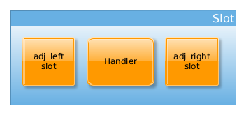

## AWS-C-IO

This is a module for the AWS SDK for C. It handles all IO and TLS work for application protocols. 

aws-c-io is an event driven framework for implementing application protocols. It is built on top of
cross-platform abstractions that allow you as a developer to think only about the state machine and API
for your protocols. A typical use-case would be to write something like Http on top of asynchronous-io
with TLS already baked in. All of the platform and security concerns are already handled for you.

It is designed to be light-weight, fast, portable, and flexible for multiple domain use-cases such as:
embedded, server, client, and mobile.

## License

This library is licensed under the Apache 2.0 License. 

## Concepts

### Event Loop
Core to Async-IO is the event loop. We provide an implementation for most platforms out of the box:

Platform | Implementation
--- | ---
Linux | Edge-Triggered Epoll
BSD Variants and Apple Devices | KQueue
Windows | IOCP (IO Completion Ports)
Default Fallback | Select
Custom | Whatever you want!

An Event Loop has a few jobs.

1. Notify subscribers of IO Events
2. Execute and maintain a task scheduler
3. Maintain an opaque data store for consumers

The threading model for a channel (see below) is pinned to the thread of the event loop. Each event-loop implementation
provides a API to move a cross-thread call into the event-loop thread if necessary.

### Channels and Slots
A channel is simply a container that drives the slots. It is responsible for providing an interface
between slots and the underlying event-loop as well as invoking the slots to pass messages. As a channel 
runs, it makes sure that all messages queues are empty before returning control to the caller. It also provides
utilities for making sure slots and their handlers run in the correct thread and moving execution to that thread
if necessary.

In this diagram, a channel is a collection of slots, and it knows how to make them communicate. It also controls the 
lifetime of slots.

### Slots

Slots contain 2 queues, one for the write direction, and one for the read direction. In addition, they maintain their links
to adjacent slots in the channel. Most importantly, they contain a reference to a handler. Handlers are responsible for doing
most of the work (see below). Finally, slots have an API that manages invoking the handler, from the channel's perspective, as well
as utilities for manipulating the connections of the slots themselves.

### Channel Handlers
The channel handler is the fundamental unit that protocol developers will work with. It contains all of your
state machinery, framing, and optionally end-user APIs.

Channel Handlers are runtime polymorphic. Here's some details on the virtual table (v-table).

`int data_in ( struct aws_io_message *msg)`

Data in is invoked by the slot when an application level message is received in the read direction (from the io).
The job of the implementer is to process the data in msg and either notify a user or queue a new message on the slot's
read queue.

`int data_out (struct aws_io_message *msg)`

Data Out is invoked by the slot when an application level message is received in the write direction (to the io).
The job of the implementer is to process the data in msg and either notify a user or queue a new message on the slot's
write queue.

`size_t update_window (size_t size_)`

Update Window is invoked by the slot when a framework level message is received from a downstream handler.
It only applies in the read direction. This gives the handler a chance to make a programmatic decision about 
what its read window should be. The return value will be passed to the next adjacent handler.

`int shutdown_notify (int error_code_)`

Shutdown notify is invoked by the slot when a framework level message is received from an adjacent handler.
This notifies the handler that the previous handler in the chain has shutdown and will no longer be sending or
receiving messages. Upon sending a shutdown_notify message, that handler and slot will be removed from the channel.

`int shutdown_direction ( enum aws_channel_direction dir_)`

Shutdown direction is invoked by the slot to close the message processing in a given direction (either read, write, or both).
This is a notification to begin the process. For example, in TLS, there is a shutdown sequence that happens between client and server,
so it may take a few ticks of the event loop for this process to finish. A handler will invoke shutdown_notify when it has
completed this process.

`void destroy()`

Clean up any memory or resources owned by this handler, and then deallocate the handler itself.

#### Special, pre-defined handlers
Out of the box you get a few handlers pre-implemented.
1. Sockets. We've done the heavy lifting of implementing a consistent sockets interface for each platform.
Sockets interact directly with the underlying io and are invoked directly by the event loop for io events.
2. Pipes (or something like them depending on platform), these are particularly useful for testing.
3. TLS. We provide TLS implementations for most platforms.

Platform | Implementation
--- | ---
Linux | Signal-to-noise (s2n) see github.com/awslabs/s2n
BSD Variants | s2n
Apple Devices | Security Framework/ Secure Transport. See https://developer.apple.com/documentation/security/secure_transport
Windows | Secure Channel. See https://msdn.microsoft.com/en-us/library/windows/desktop/aa380123(v=vs.85).aspx
Custom | You can always write your own handler around your favorite implementation

### Typical Channel

A typical channel will contain a socket handler, which receives io events from the event loop.
It will read up to 16 kb and pass the data to the next handler. The next handler is typically 
feeding a TLS implementation (see the above section on pre-defined handlers). The TLS handler
will then pass the data to an application protocol. The application protocol could then expose an
API to an application. When the application wants to send data, the whole process runs in reverse.

Channels can be much more complex though. For example, there could be nested channels for multiplexing/de-multiplexing,
or there could be more handlers to cut down on handler complexity.

Note however, that a channel is always pinned to a single thread. It provides utilities for applications and
handlers to move a task into that thread, but it is very important that handlers and application users
of your handlers never block.

### Read Back Pressure

One of the most challenging aspects of asynchronous io programming, is managing when back-pressure should be applied to
the underlying io layer. In the read direction, this is managed via update_window messages. Let's look at the below diagram
for an example of how this works.

In this example, we have a channel setup with an event loop which manages io event notifications. The first slot contains a socket handler.
The socket handler will always context switch after reading 16kb to ensure fairness for other channels, but it doesn't have a 
window. The second slot has a TLS handler. Its only job is to encrypt/decrypt the data passed to it and pass it back to the channel.
The third and final slot contains the actual application protocol handler (could be Http, SIP, RTP it doesn't really matter).

The application protocol exposes an API to the application. As data is processed, we don't want to endlessly read, allocate,
and process data faster than the application can use it. As a result, it has a 20kb window.

1. The event loop notifies the socket handler that it has data available to read. The handler knows it can read up to 20kb
so it reads a full 16kb from the socket and passes it to the next slot. Since the socket sees that there is still an open window,
it, schedules a task to read again after the other channels have had a chance to process their pending reads. 

    Likewise, the TLS handler decrypts the data and passes
it to the slot containing the application protocol. 

    The application protocol processes the 16 kb and hands it off to the application.
At this point, the application hasn't notified the channel it is finished with the data (suppose application queues it), so the
new window for the slot is 4 kb.

2. The event loop runs the scheduled read task from (1) after processing the other channels. The socket handler sees it
can read 4kb more of data. Even though it can read 16kb at a time, to honor the window, it reads 4kb and passes it on. This
time however, the window is 0, so the socket does not schedule another read task.

    The TLS handler decrypts the data and passes it on

    The application protocol reads 4kb, passes it to the application and its window is 0kb. 

    The channel now goes idle waiting on the application to finish processing its data.

3. The application notifies the channel (via the API on the application protocol handler) it has processed 20kb
of data. This causes the protocol handler to issue an update_window message with an update of 20kb.

    Slot 2 passes the message on to the TLS handler. It evaluates the message and simply returns unlimited for its window.

    The socket handler receives the update_window message and schedules a new read task.

4. The event-loop runs the scheduled read task from (3). The socket reads on the io-handle, but it returns EAGAIN or
EWOULD_BLOCK. The channel now goes back to an idle state waiting on the event-loop to notify it that the socket is readable.

### Write Back Pressure

Write back pressure comes into play when the application can produce data more quickly than it can be sent to the 
underlying io. To manage this, messages have members to attach a promise fn and context data to. When a handler exposes
and API, it has the responsibility to take a fn and data from the user if over write is a possibility. The io-handler will
invoke the promise after it has successfully written the last byte to the underlying io.